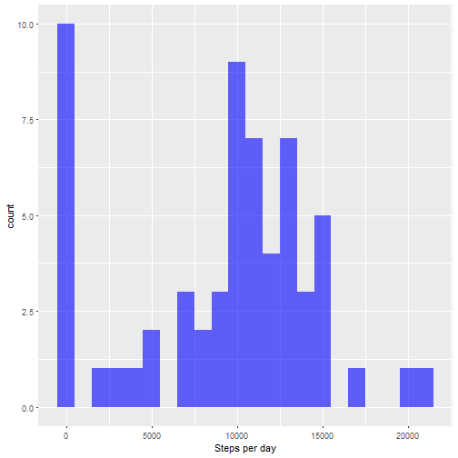
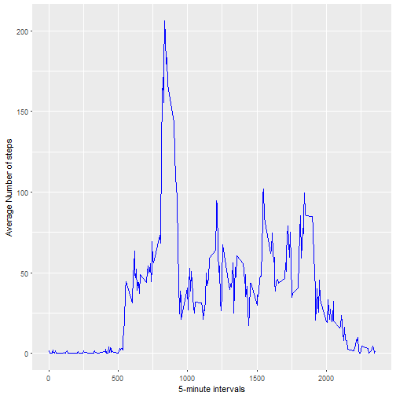
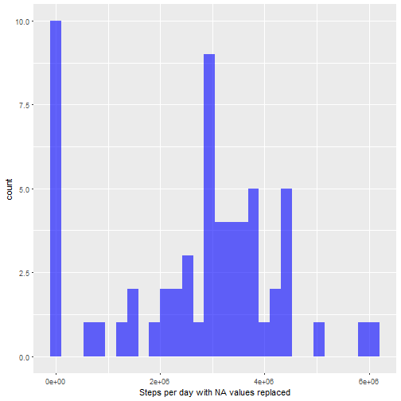
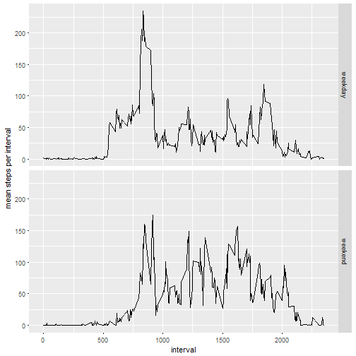

---

##This is a mark down file for the coursera course Reproducible research.

###loading and preprocessing the data.

This script requires that the ggplot2 package gas already been installed and that the current working directory contains the activity.csv file as supplied by the coursera Team

Load the ggplot2 package and then use read.csv to read the data into R studio. Next name the columns using colNames.


```r
library("ggplot2")
```

```
## Warning: package 'ggplot2' was built under R version 3.3.2
```

```
## Need help? Try the ggplot2 mailing list:
## http://groups.google.com/group/ggplot2.
```

```r
Activity<-read.csv("activity.csv",stringsAsFactors = FALSE)
colnames(Activity)<-c("steps","date","interval")
```

###Plot the mean total number of steps taken per day

Calculate and plot the total number of steps taken per day using the tapply function on the dataset and calling the 
histogram, using qplot function from the ggplot2 package 


```r
Steps<-tapply(Activity$steps,Activity$date,sum,na.rm=T)
qplot(Steps,bins=20,binwidth= 1000,xlab = "Steps per day",fill=I("blue"),alpha=I(0.6))
```



Calculate and show the man of the total number of steps per day


```r
mean(Steps)
```

```
## [1] 9354.23
```

Calculate the medain number of the total number of steps per day

```r
median(Steps)
```

```
## [1] 10395
```

###Plot the Daily activity pattern

plot a time series of the average number of steps taken in a 5-minute interval


```r
meanInterval<-tapply(Activity$steps,Activity$interval,mean,na.rm =T)
intervals<-as.numeric(rownames(meanInterval))
qplot(intervals,meanInterval,geom="line",col=I("blue"),xlab = "5-minute intervals", ylab = "Average Number of steps")
```



check which interval has the highest mean steps


```r
subset(meanInterval,meanInterval>200)
```

```
##      835 
## 206.1698
```

### Input missing values

1. Copy activity data into a new variable to be updated.
2. Find rows where steps are equal to NA and use a for loop to iterate over these records updating each row with the mean value
   for the reading that day 
   

```r
ActivityClean<-Activity
for (i in Activity$steps[is.na(Activity$steps)])
        {ActivityClean$steps[is.na(Activity$steps[i])]<-Steps[Activity$date[is.na(Activity$steps[i])]]}
```

Calculate and plot the updated total number of steps taken per day using the tapply function on a histogram 


```r
StepsClean<-tapply(ActivityClean$steps,ActivityClean$date,sum,na.rm=T)
qplot(StepsClean,xlab = "Steps per day with NA values replaced",fill=I("blue"),alpha=I(0.6))
```

```
## `stat_bin()` using `bins = 30`. Pick better value with `binwidth`.
```



Calculate and show the updated mean of the total number of steps per day


```r
mean(StepsClean)
```

```
## [1] 2694018
```

Calculate the updated medain number of the total number of steps per day

```r
median(StepsClean)
```

```
## [1] 2993760
```

### Conclusion from replacing NA Values

Reaplcing the NA values of steps taken with the mean number of steps taken that day has increased both the mean and median values of the daily total number of steps this was too be expected as there are now substantially more records of steps taken than in the initial data set

### Add a column to the data set to indicate whether the date is a weekday or weekend.

use the weekdays function to calculate the day of the week that each reading was taken.Then use gsub to replace monday to Friday days with the word "weekday" and saturday and sunday with the word weekend.


```r
Activity$weekend<-sapply(as.Date(Activity$date),weekdays)
Activity$weekend<-gsub(("Monday|Tuesday|Wednesday|Thursday|Friday"),"weekday",Activity$weekend)
Activity$weekend<-gsub(("Saturday|Sunday"),"weekend",Activity$weekend)
```

calculate average steps per interval by day type using tapply, reshaping the data to suit grapical presentation through ggplot


```r
Steps<-with(Activity,tapply(steps,list(interval,weekend),mean,na.rm=T))
Steps<-as.data.frame(Steps)
Steps$interval<-as.integer(row.names(Steps))

library(tidyr)
```

```
## Warning: package 'tidyr' was built under R version 3.3.2
```

```r
stepsByType<-gather(Steps,dayType,mean,1:2)
with(stepsByType,ggplot(stepsByType,aes(interval,mean))+geom_line()+facet_grid(dayType ~ .)+ylab("mean steps per interval"))
```




